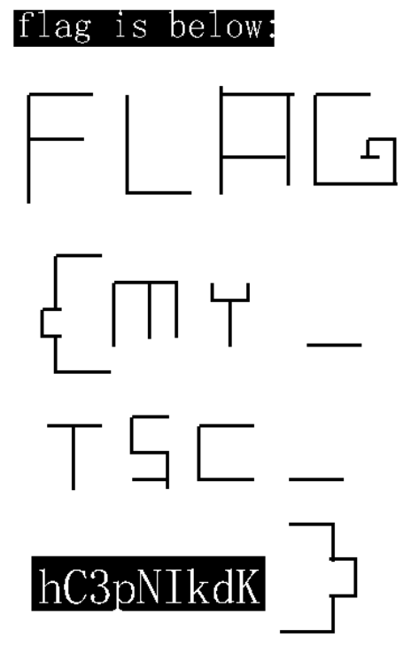

# PRINTER
## Task
```
The supermarket bought a new printer last night. I hacked into their computer and captured the USB traffic on it. Could you help me steal the secret?

Flag format: flag{0-9a-z_} (Convert uppercase to lowercase)
```
There is also an attachment - Printer.pcapng. I opened the file in wireshark. We're looking for transfer that will come from the host so let's filter out the data like this: `usb.src == host`. Let's also order by length. We can see interesting huge URB_BULK packet. Export the leftover capture data to a new file. Hex dump of the first few lines of the file looks like this:
```
00000000  53 45 54 20 54 45 41 52  20 4f 4e 0d 0a 43 4c 53  |SET TEAR ON..CLS|
00000010  0d 0a 42 49 54 4d 41 50  20 31 33 38 2c 37 35 2c  |..BITMAP 138,75,|
00000020  32 36 2c 34 38 2c 31 2c  ff ff ff ff ff ff ff ff  |26,48,1,........|
00000030  ff ff ff ff ff ff ff ff  00 ff ff ff ff ff ff ff  |................|
00000040  ff ff ff ff ff ff ff ff  ff ff ff ff ff ff ff ff  |................|
00000050  ff ff c3 ff ff ff ff ff  ff ff ff ff ff ff ff ff  |................|
00000060  ff ff ff ff ff ff ff ff  ff ff ff ff e7 ff ff ff  |................|
00000070  ff ff ff ff ff ff ff ff  ff ff ff ff ff ff ff ff  |................|
00000080  ff ff ff ff ff ff e7 ff  ff ff ff ff ff ff ff ff  |................|
00000090  ff ff ff ff ff ff ff ff  ff ff ff ff ff ff ff ff  |................|
000000a0  e7 ff ff ff ff ff ff ff  ff ff ff ff ff ff ff ff  |................|
000000b0  ff ff ff ff ff ff ff ff  ff ff e7 ff ff ff ff ff  |................|
000000c0  ff ff ff ff ff ff ff ff  ff ff ff ff ff ff ff ff  |................|
000000d0  ff ff ff ff e7 ff e3 ff  fe 1f ff ff ff ff f8 07  |................|
000000e0  c0 3c 60 3f c0 7c 07 e0  00 7f 7f f0 1f 80 67 ff  |.<`?.|........g.|
000000f0  00 7f f8 03 fc 07 c0 3f  ff 1f f1 f0 4f 8f f1 ff  |.......?....O...|
00000100  1f ff 1f ff 3f fc ff 1f  27 fc 7f 1f f3 e1 ff 1f  |....?...'.......|
00000110  f9 ff ff 1f f1 fc 1f cf  f8 ff 1f ff 1f ff 3f fe  |..............?.|
00000120  fe 3f 87 f8 ff 9f ef f8  ff 1f f9 ff ff 8f f1 fc  |.?..............|
00000130  3f c7 fc ff 1f ff 1f ff  1f fe fc 7f c7 f9 ff 8f  |?...............|
```
We can see some ASCII characters there so lets google them: `SET TEAR ON CLS BITMAP` -> https://www.dobus.ru/pdf/programming-manual-for-ht300.pdf. That's nice, we now have documentation for the printer's protocol. So let's implement the important commands (BAR and COMMANDS were enough) in python like that:
```python
from PIL import Image, ImageDraw
import re
img = Image.new('RGB', (1000, 1000), color = 'white')
data = open('printer_data.bin', 'rb').read()
draw = ImageDraw.Draw(img)
commands = [[]]
current = 0
for byte in data:
    commands[current].append(byte)
    if commands[current][-2:] == [13, 10]: # Split commands by CLRF
        commands[current] = commands[current][:-2]
        current += 1
        commands.append([])
commands = commands[:-1]
for command in commands:
    buffer = ""
    for byte in command:
        buffer += chr(byte)
    cmd = buffer.split(' ')[0]

    if cmd == 'BAR':
        coords = re.split(' |, ', buffer)[1:]
        coords = list(map(int, coords))
        draw.rectangle(((coords[0], coords[1]), (coords[0] + coords[2], coords[1] + coords[3])), fill="black")
    elif cmd == 'BITMAP':
        coords = list(map(int, re.split(' |,', buffer)[1:5]))
        data = []
        started = False
        for byte in command: # Extract binary data from the command
            if byte == 255 or started:
                started = True
                data.append(byte)
        x = 0
        y = 0
        for byte in data:
            byte_data = "{0:08b}".format(byte)
            for pixel in byte_data:
                color = ""
                if pixel == '1':
                    color = "black"
                else:
                    color = "white"
                cal_x = coords[0] + x
                cal_y = coords[1] + y
                draw.rectangle(((cal_x, cal_y), (cal_x + 1, cal_y + 1)), fill=color)
                x += 1
                if x/8 == coords[2]:
                    x = 0
                    y += 1
    else:
        print(cmd)
img.save('decoded.png')
```
Decoded image look's like this:



So the flag is: `flag{my_tsc_hc3pnikdk}`
